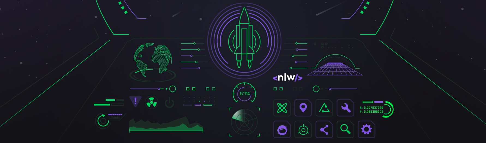
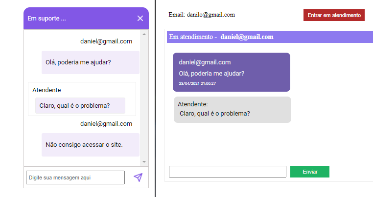

<h1 align="center">
  :rocket: Next Level Week 5.0 :rocket:
</h1>

  

  
  
  
  

  

---

## Projeto
O projeto tem como objetivo a criação de um chat de suporte onde os clientes podem ser atendidos. A aplicação funciona atravês de **WEBSOCKET**  e tem as mensagens sendo enviadas e recebidas de forma instantânea entre cliente e administrador. 

O desenvolvimento ocorreu durante a Next Level Week #4 da [Rocketseat](https://rocketseat.com.br/). :rocket:
 

---
## Etapas da Next Level Week #5

- **19/Abril:** Liftoff :heavy_check_mark:
- **20/Abril:** Maximum Speed :heavy_check_mark:
- **21/Abril:** In Orbit :heavy_check_mark:
- **22/Abril:** Landing :heavy_check_mark:
- **23/Abril:** Surface Exploration :heavy_check_mark:

---

## :pushpin: Projeto

  

---
## Tecnologias

Esse projeto utilizou as seguintes tecnologias:

- [Node.js](https://nodejs.org/en/)
- [Express](https://expressjs.com/pt-br/)
- [Sqlite3](https://www.npmjs.com/package/sqlite3)
- [typeORM](https://typeorm.io/#/)
- [socket.io](https://socket.io/)

---
## Licença

[LICENSE](LICENSE) & [Rocketseat](https://rocketseat.com.br/)

---
:shipit: